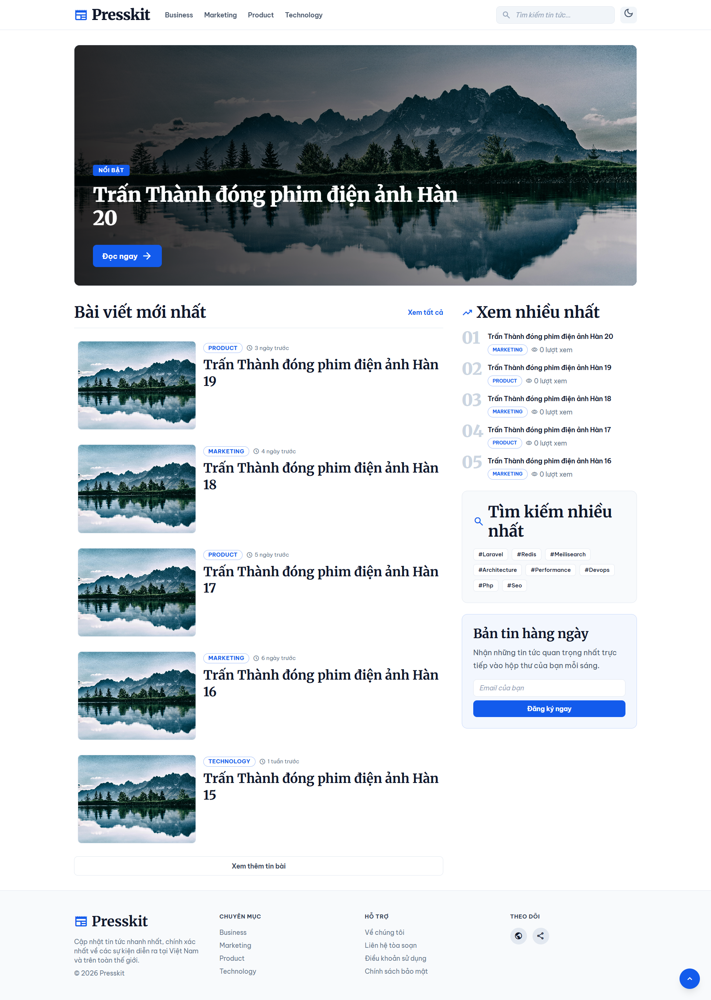

# 📰 PressKit: CMS Báo Điện Tử Hiện Đại

<div align="center">
  
</div>

<div align="center">

**Boost Productivity, Optimize SEO, and Scale Your Online Newspaper.**

[](https://laravel.com/)
[](https://opensource.org/licenses/MIT)
[](https://github.com/your-org/presskit/actions)
[](https://github.com/your-org/presskit)
[](https://github.com/your-org/presskit)

</div>

---

**PressKit** là một hệ thống quản trị nội dung (CMS) chuyên dụng cho báo điện tử, được xây dựng trên nền tảng **Laravel**. Hệ thống tập trung vào hiệu suất cao, tối ưu SEO vượt trội và khả năng mở rộng linh hoạt cho các tòa soạn lớn. Với PressKit, bạn có thể nhanh chóng xây dựng, quản lý và xuất bản nội dung báo chí chuyên nghiệp.

---

## ✨ Các tính năng vượt trội

<table align="center">
  <tr>
    <td align="center" width="180px">
      <br><strong>🚀 Xuất bản siêu tốc</strong>
    </td>
    <td align="center" width="180px">
      <br><strong>🤖 Trợ lý AI SEO</strong>
    </td>
    <td align="center" width="180px">
      <br><strong>📈 Phân tích Xu hướng</strong>
    </td>
    <td align="center" width="180px">
      <br><strong>🔄 Workflow Linh hoạt</strong>
    </td>
  </tr>
</table>

- ⚡️ **Hạ tầng tối ưu:** Kiến trúc mở rộng, sẵn sàng cho hệ thống chịu tải lớn, tối ưu tốc độ tải trang.
- 🤖 **AI SEO:** Tích hợp AI hỗ trợ biên tập, gợi ý meta description, từ khóa và tối ưu hóa cấu trúc bài viết.
- 📈 **Trending & Scoring:** Thuật toán tính toán bài viết Hot theo thời gian thực (Decay Algorithm).
- 🔄 **Quy trình chuyên nghiệp:** Hỗ trợ quy trình kiểm duyệt chuẩn tòa soạn: Editor - Reviewer - Publisher.
- 📱 **Mobile AMP Ready:** Tự động tạo phiên bản AMP tối ưu cho thiết bị di động.
- 💰 **Quản lý Quảng cáo:** Tích hợp Google Ads, Banner Ads và Native Ads.
- 📊 **User Analytics:** Theo dõi Page view, Reading time, Scroll depth và Share count.

---

## 🛠 Công nghệ sử dụng

PressKit được xây dựng trên những công nghệ hiện đại nhất:

| Công nghệ | Mục đích |
| :--- | :--- |
| **Laravel** | Backend Framework mạnh mẽ |
| **MySQL** | Cơ sở dữ liệu chính |
| **Redis** | Xử lý Cache, Counter và Ranking bài viết |
| **Meilisearch** | Công cụ Full-text search tốc độ cao |
| **Filament** | Giao diện quản trị (Admin Panel) hiện đại |
| **CDN** | Phân phối nội dung tĩnh toàn cầu |

---

## 💻 Hướng dẫn cài đặt nhanh

### Yêu cầu hệ thống
* PHP >= 8.2
* MySQL >= 8.0
* Node.js & NPM
* Redis & Composer

### Các bước cài đặt
```bash
# Clone dự án
git clone https://github.com/trunglt706/PressKit.git
cd presskit

# Cài đặt thư viện
composer install

# Cấu hình môi trường
cp .env.example .env
php artisan key:generate

# Khởi tạo dữ liệu
php artisan migrate
php artisan db:seed

# Cài đặt các gói phụ thuộc
npm install

# Build assets cho môi trường production 
npm run build

# HOẶC chạy môi trường phát triển (Hot Reload)
npm run dev

# Khởi động dịch vụ
php artisan serve

```
## 🤝 Liên hệ & Đóng góp

Chúng tôi hoan nghênh mọi đóng góp của bạn để phát triển PressKit tốt hơn! Hãy tạo Issue hoặc Pull Request trên GitHub.

-   **Author:** PressKit Team
    
-   **License:** MIT
    

----------

<div align="center"> <sub>PressKit | Developed with ❤️ by the PressKit Team</sub> </div>